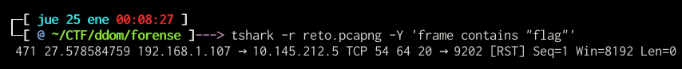

# Retos

## Volatil I (75pts)

Alguien tenia claves en un fichero de texto pero no le dio a guardar.

https://drive.google.com/open?id=1atYLiCl86RN1kwQLY854DOoIReb7bPAx

	sha1 632a21efc8a40e0e6138c64f17f90bbf347fe30f
	md5 23b978c8aaab840e85a004adc2cf3e1a

### Solución

Para solucionar este reto es necesario primero identificar el profile de la imagen que se descargo del drive:

	volatility -f ram.raw imageinfo
	

	
Posterior a esto, y siendo mas directos, buscamos la palabra "flag{" dentro de la imagen:


Usuario y archivo temporal encontrado. 

### Flag

	flag{ramstringscapture}

## Tráfico (100pts)

	reto.pcapng fa77dedc4e482167efe9bf23e624b345

### Solución

Para solucionar este reto debemos explorar el archivo pcapng en wireshark, despues de horas analizando el archivo veremos comunicacion a diferenes sitios pero ninguno que diga flag, por lo que al realizar un _frame contains "flag"_ nos lleva a un pequeño paquete extraño, un RST.



Eso es extraño. Hagamos un byte details sobre el tshark:


Oh rayos, que es eso... Después de revisar bien y separar el paquete, el ascii que vemos de "flag{" que tiene el formato de las banderas, se esta generando sobre la MAC address de origen de la IP 192.168.1.107.

	00 16 b6 ac be de	......
	20 66 6c 61 67 7b	 flag{

Filtremos mas comunicación de puerto tcp/20 y la dirección 192.168.1.107:


Ahora bien, vemos si también coinciden con el valor de MAC address encontrado:

```
tshark -r reto.pcapng -Y 'ip.src==192.168.1.107 and tcp.port==20' -x
0000  00 16 b6 ac be de 73 6f 5f 69 73 5f 08 00 45 00   ......so_is_..E.
0010  00 28 00 01 00 00 40 06 da 25 c0 a8 01 6b 0a 91   .(....@..%...k..
0020  d4 05 00 14 23 f4 00 00 00 00 00 00 00 00 50 04   ....#.........P.
0030  20 00 cb 2e 00 00                                  .....

0000  00 16 b6 ac be de 64 65 20 69 73 3a 08 00 45 00   ......de is:..E.
0010  00 28 00 01 00 00 40 06 da 25 c0 a8 01 6b 0a 91   .(....@..%...k..
0020  d4 05 00 14 23 f1 00 00 00 00 00 00 00 00 50 04   ....#.........P.
0030  20 00 cb 31 00 00                                  ..1..

0000  00 16 b6 ac be de 64 75 6d 62 7d 00 08 00 45 00   ......dumb}...E.
0010  00 28 00 01 00 00 40 06 da 25 c0 a8 01 6b 0a 91   .(....@..%...k..
0020  d4 05 00 14 23 f5 00 00 00 00 00 00 00 00 50 05   ....#.........P.
0030  20 00 cb 2c 00 00                                  ..,..

0000  00 16 b6 ac be de 20 66 6c 61 67 7b 08 00 45 00   ...... flag{..E.
0010  00 28 00 01 00 00 40 06 da 25 c0 a8 01 6b 0a 91   .(....@..%...k..
0020  d4 05 00 14 23 f2 00 00 00 00 00 00 00 00 50 04   ....#.........P.
0030  20 00 cb 30 00 00                                  ..0..

0000  00 16 b6 ac be de 6f 75 72 5f 63 69 08 00 45 00   ......our_ci..E.
0010  00 28 00 01 00 00 40 06 da 25 c0 a8 01 6b 0a 91   .(....@..%...k..
0020  d4 05 00 14 23 f3 00 00 00 00 00 00 00 00 50 04   ....#.........P.
0030  20 00 cb 2f 00 00                                  ../..

0000  00 16 b6 ac be de 54 68 65 20 63 6f 08 00 45 00   ......The co..E.
0010  00 28 00 01 00 00 40 06 da 25 c0 a8 01 6b 0a 91   .(....@..%...k..
0020  d4 05 00 14 23 f0 00 00 00 00 00 00 00 00 50 06   ....#.........P.
0030  20 00 cb 30 00 00                                  ..0..

```

Se identifica como una especie de texto desordenado. Veamos si ordenamos por numero de puerto y lo presentamos en ascii con la magia del siguiente script:

	for char in $(tshark -r reto.pcapng -Y 'ip.src==192.168.1.107 and tcp.port==20' -e tcp.dstport -e eth.src  -Tfields | sort | cut -f2 | tr '\n' ' ' | tr ':' ' '); do printf "\x$char"; done
	


Con eso la flag se aparece delante de nosotros.

### Flag

	flag{our_ciso_is_dumb}

## Volatil II (150pts)

¿Que estaba visitando?

https://drive.google.com/file/d/1Ol7AAlZueIUcVbjqyLZOc_eNUmUNfEJq/view?usp=drivesdk

	sha1 0642cf6c29a8f762afb69e9bad448bfc9877edad
	md5 aad65ecdc25ffdf73da5d399a5a44c63

### Solución

Para solucionar este reto, lo primero que se realizo fue identificar el profile de la imagen que se descargo del drive:

	volatility -f ram2.raw imageinfo
	

	
Posterior a esto, y usando el profile recomendado, se listaron los procesos via pslist y se busco por procesos comunes de navegadores:

	volatility -f ram2.raw --profile=Win10x64_10586 pslist  | egrep "chrome|firefox|ie"


Al detectarse chrome, se uso un [plugin de volatility](https://github.com/superponible/volatility-plugins) que busca sobre el historial de la imagen de RAM:

	volatility --plugins="volatility-plugins/" -f ram2.raw --profile=Win10x64_10586 chromehistory | tail


La salida del comando nos muestra varias URLs de donde tenemos una sospechosa "CTF - Pastebin.com":

	https://pastebin.com/iNGBs3v5

Al visitar la pagina veremos que hay un texto codificado con base64, por lo que copiamos y aplicamos un rápido base64 -d:

	printf "ZmxhZ3tpbmNvZ25pdG9tb2RlfQ==" | base64 -d

Boom! ya tenemos la flag.

### Flag

	flag{incognitomode}

## Ransomware (400pts)

Estaba modificando algunas muestras de ransomware y ejecutado una sin querer :(.

Menos mal que tenía la clave en un archivo.


Evidencia: https://goo.gl/ybqo9R 

### Solución

### Flag
