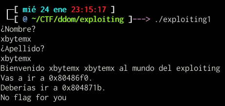
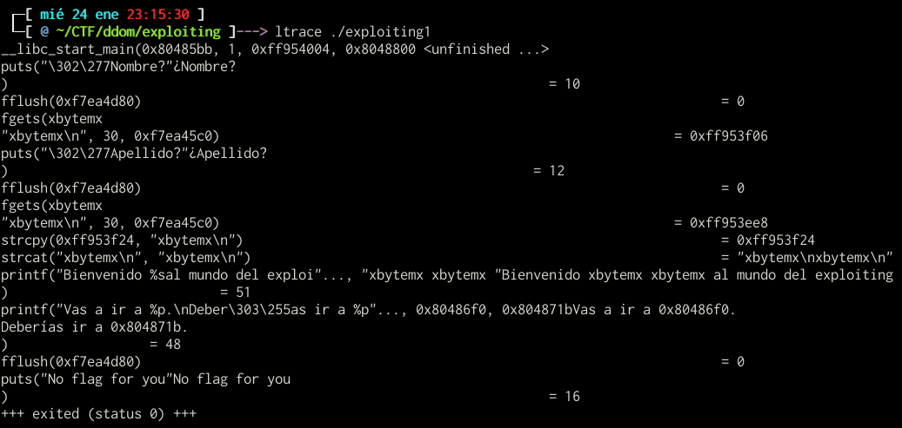
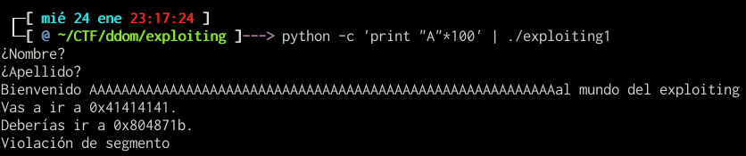
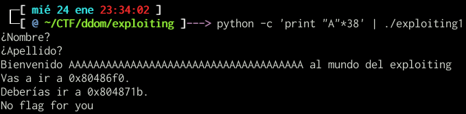
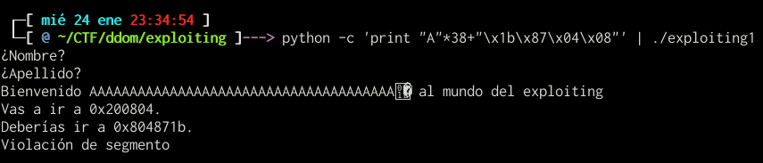
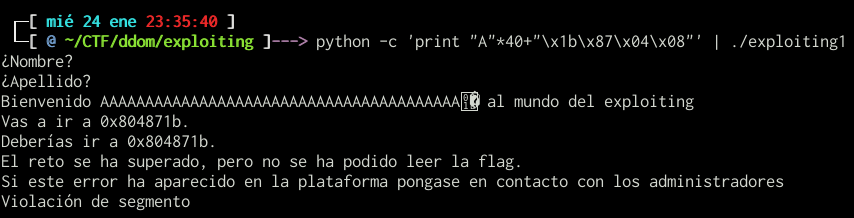
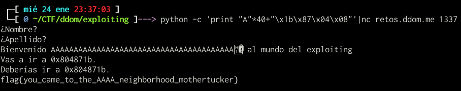

# Retos

## Exploiting I (50pts)

Para ir calentando.

retos.ddom.me:1337

	exploiting1 3116f96f4ee046a4fa4732aa3dd4379e

### Solución
Para solucionar este reto, debemos primero descargar el binario y ejecutarlo:

Como podemos observar requiere que el usuario ingrese dos parametros, observemos si con ltrace podemos ver que funciones estan siendo utilizadas:

Asi que se usa puts y fgets para manejar strings... 

Esta ultima es bastante común de explotar, puesto que cuando es mal implementada, un usuario puede agregar mas valores de los esperados, saliendose del buffer y causando un _buffer overflow_.

Probemos a salirnos del buffer:

Como podemos observar, el programa termino por una violación de segmento o mejor dicho porque no pudo retornar correctamente. Si leemos el valor de "Vas a ir" veremos un 0x41414141 que corresponde al string que ingrese "AAAA" muchas veces.

Como trataremos de medir cual es la longitud, la reduciremos hasta tenerla en 38:

Aqui vemos que el programa termina de manera normal y que la direccion de "Vas a ir" es la misma que la original, por lo que no la hemos sobreescrito. Ahora probemos a agregar un valor parecido al esperado pero en litle-endian:

Bingo, ya se empieza a mostrar el valor sobre la direccion deseada, empujamos con dos "A" mas y listo, tenemos otro mensaje en pantalla:

De acuerdo, nos dice que es correcto pero no podemos ver la flag. En ese punto inverti mucho tiempo reverseando el binario hasta que cai en algo, nos dieron un host y un puerto... probemos a enviar el output de python por nc:

Como podemos observar, se obtiene la flag al enviarle al puerto la cadena correcta.

### Flag

	flag{you_came_to_the_AAAA_neighborhood_mothertucker}

## Exploiting II (100pts)

Hemos dejado la flag por ahí apilada...

retos.ddom.me:2448

## Exploiting III (400pts)
La mazmorra a continuación es muy aleatoria, así que será mejor que prepares una buena ficha de personaje.

retos.ddom.me:4089

	exploiting3 525049c8c38883915bde60adf42bb9db

